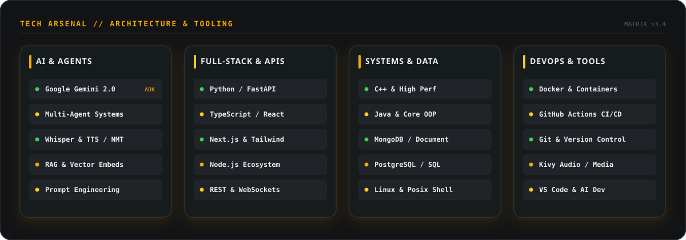
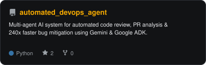
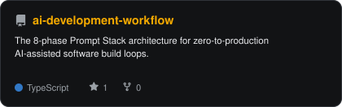
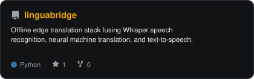
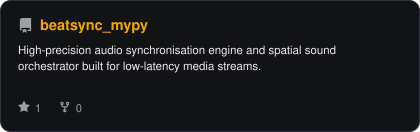
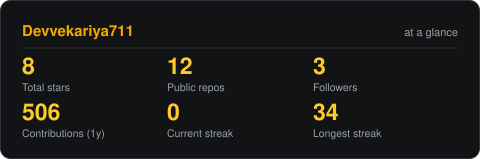

<div align="center">

<!-- HERO BANNER: Animated Header with Embedded Side Portrait (face-cropped, no text bleed) -->


<br/>

<!-- TYPING ANIMATION -->
<a href="https://git.io/typing-svg">
  
</a>

<br/><br/>

<!-- SOCIAL BADGES -->
[](https://github.com/Devvekariya711)
[](mailto:devvekariya711@gmail.com)


</div>

---

## `01 / IDENTITY`

<table>
<tr>
<td width="34%" align="center" valign="middle">
  
</td>
<td width="66%" valign="top">

### Dev Vekariya 👋
**AI & Autonomous Systems Architect** • Gujarat, India

I build systems that operate without babysitting — multi-agent architectures, edge AI tooling, and developer velocity multipliers.

```text
FOCUS       :: Multi-Agent AI • Agentic RAG • Local LLMs
BENCHMARK   :: 240x Velocity • 74% Automated Bug Detection
STACK       :: Python • Gemini 2.0 • TypeScript • FastAPI • Docker
MODE        :: Learn → Build → Break → Ship
```

</td>
</tr>
</table>

---

## `02 / TECH ARSENAL`

<div align="center">
  
</div>

---

## `03 / FEATURED PROJECTS`

<table width="100%">
<tr>
<td width="50%">
  <a href="https://github.com/Devvekariya711/automated_devops_agent">
    <picture>
      <source media="(prefers-color-scheme: dark)" srcset="assets/card-automated_devops_agent-dark.svg">
      <source media="(prefers-color-scheme: light)" srcset="assets/card-automated_devops_agent-light.svg">
      
    </picture>
  </a>
</td>
<td width="50%">
  <a href="https://github.com/Devvekariya711/ai-development-workflow">
    <picture>
      <source media="(prefers-color-scheme: dark)" srcset="assets/card-ai-development-workflow-dark.svg">
      <source media="(prefers-color-scheme: light)" srcset="assets/card-ai-development-workflow-light.svg">
      
    </picture>
  </a>
</td>
</tr>
<tr>
<td width="50%">
  <a href="https://github.com/Devvekariya711/linguabridge">
    <picture>
      <source media="(prefers-color-scheme: dark)" srcset="assets/card-linguabridge-dark.svg">
      <source media="(prefers-color-scheme: light)" srcset="assets/card-linguabridge-light.svg">
      
    </picture>
  </a>
</td>
<td width="50%">
  <a href="https://github.com/Devvekariya711/beatsync_mypy">
    <picture>
      <source media="(prefers-color-scheme: dark)" srcset="assets/card-beatsync_mypy-dark.svg">
      <source media="(prefers-color-scheme: light)" srcset="assets/card-beatsync_mypy-light.svg">
      
    </picture>
  </a>
</td>
</tr>
</table>

---

## `04 / SKILL RADAR`

<table width="100%">
<tr>
<td width="50%" align="center">
  <picture>
    <source media="(prefers-color-scheme: dark)" srcset="assets/radar-skills-dark.svg">
    <source media="(prefers-color-scheme: light)" srcset="assets/radar-skills-light.svg">
    
  </picture>
</td>
<td width="50%" align="center">
  <picture>
    <source media="(prefers-color-scheme: dark)" srcset="assets/radar-langs-dark.svg">
    <source media="(prefers-color-scheme: light)" srcset="assets/radar-langs-light.svg">
    
  </picture>
</td>
</tr>
</table>

---

## `05 / GITHUB STATS`

<div align="center">
  <picture>
    <source media="(prefers-color-scheme: dark)" srcset="assets/card-stats-dark.svg">
    <source media="(prefers-color-scheme: light)" srcset="assets/card-stats-light.svg">
    
  </picture>
</div>

<br/>

<div align="center">
  
</div>

---

## `06 / CONTRIBUTION SNAKE`

<div align="center">
<picture>
  <source media="(prefers-color-scheme: dark)" srcset="https://raw.githubusercontent.com/Devvekariya711/Devvekariya711/output/snake-dark.svg">
  <source media="(prefers-color-scheme: light)" srcset="https://raw.githubusercontent.com/Devvekariya711/Devvekariya711/output/snake-light.svg">
  
</picture>
</div>

---

## `07 / METRICS`

<div align="center">
  
</div>

<br/>

<table width="100%">
<tr>
<td width="50%" align="center">
  
</td>
<td width="50%" align="center">
  
</td>
</tr>
</table>

---

## `08 / DIRECTIVES`

<div align="center">
  
</div>

---

<div align="center">
<sub>

`SYS_01` · `BUILD_04` · `EDGE_09` · `DEVVEKARIYA`

Animated with SMIL & SVG · Automated via GitHub Actions

`01000100 01000101 01010110`

</sub>
</div>
