<div align="center">


<br/>

<!-- Typing banner — amber on transparent, calm pace -->
<a href="https://git.io/typing-svg">
  
</a>

<br/><br/>

<!-- Social badges — amber system -->
[](https://github.com/Devvekariya711)
[](mailto:devvekariya711@gmail.com)


</div>

---

## `01 / SIGNAL`

> Engineering × AI × Automation × Creative Systems

I build systems that make complicated things easier to operate, automate work that should not need a human babysitter, and turn odd ideas into working software.

```text
STATUS      :: BUILDING
FOCUS       :: AI / AUTOMATION / FULL-STACK
MODE        :: LEARN → BUILD → BREAK → REBUILD
CURRENT     :: LOCAL AI • RAG • DEVTOOLS • AGENTS
```

---

## `02 / STACK`

<div align="center">

</div>

---

## `03 / PROJECT ARCHIVE`

<div align="center">

</div>

<br/>

| # | Project | What it does | Stack |
|---|---------|-------------|-------|
| `01` | **[LinguaBridge](https://github.com/Devvekariya711/LinguaBridge)** | Offline real-time voice translation system | Whisper · NMT · TTS · Kivy |
| `02` | **[Automated-DevOps-Agent](https://github.com/Devvekariya711/Automated-DevOps-Agent)** | Automation-first developer tooling | AI · Python · DevOps |
| `03` | **[AI-Development-Workflow](https://github.com/Devvekariya711/AI-Development-Workflow)** | AI inside the software build loop | Agents · Workflows |
| `04` | **[BeatSync](https://github.com/Devvekariya711/BeatSync)** | Media + audio synchronisation | Python · Audio · Automation |

---

## `04 / SKILL RADAR`

<div align="center">

</div>

---

## `05 / GITHUB MACHINE`

<table>
<tr>
<td width="50%" align="center">


</td>
<td width="50%" align="center">


</td>
</tr>
</table>

<div align="center">


</div>

---

## `06 / CONTRIBUTION MATRIX`

<div align="center">
<picture>
  <source media="(prefers-color-scheme: dark)" srcset="https://raw.githubusercontent.com/Devvekariya711/Devvekariya711/output/snake-dark.svg">
  <source media="(prefers-color-scheme: light)" srcset="https://raw.githubusercontent.com/Devvekariya711/Devvekariya711/output/snake-light.svg">
  
</picture>
</div>

> [!NOTE]
> The snake animation regenerates every 12 hours via GitHub Actions. If images are missing, the workflow hasn't completed its first run yet — trigger it manually from the Actions tab.

---

## `07 / METRICS`

<div align="center">
<picture>
  <source media="(prefers-color-scheme: dark)" srcset="assets/metrics-calendar.svg">
  
</picture>
</div>

<table>
<tr>
<td width="50%" align="center">

</td>
<td width="50%" align="center">

</td>
</tr>
</table>

---

## `08 / NOW`

<div align="center">

</div>

<br/>

### Philosophy

> Make the system useful first. Make it beautiful enough that people want to use it twice.

---

<div align="center">

<sub>

`SYS_01` `BUILD_04` `EDGE_09` `DEVVEKARIYA`

Built with obsessive care · Animated with SMIL · Powered by GitHub Actions

`01000100 01000101 01010110`

</sub>

</div>

